SQL ▼
# Cesty 
# C00. Nespecifikováno Cesty

# Cesty 
# C01. brod Cesty
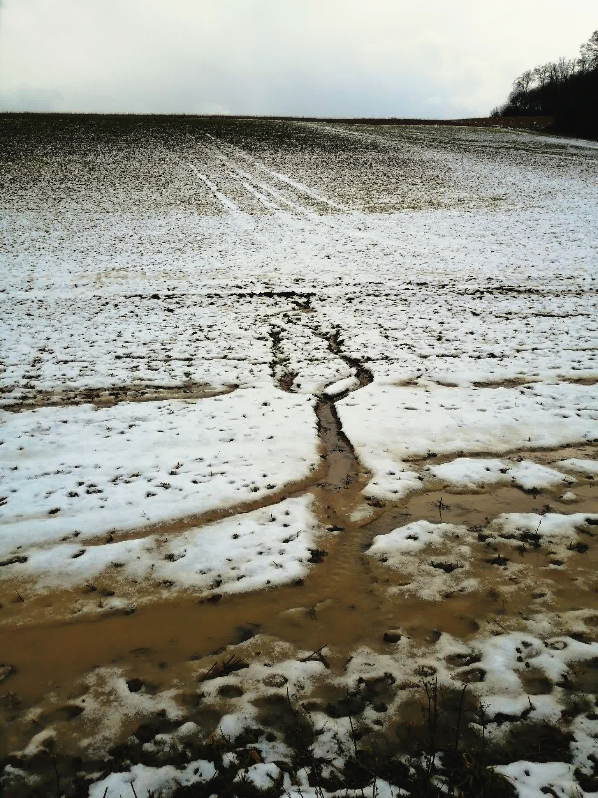

Vrstva: bod
Druh: Brod

Charakteristika
jde o úsek cesty kde se překonává vodní tok bez lávky nebo mostu. Může být zpevněný (v místech, kde není pevné dno nebo podloží toku) nebo nezpevněný.

Foto: do dáli, aby byl vidět charakter okolní krajiny

Parametry: 
    Parametryzujeme zda je brod (ne)zpevněný, jakým materiálem a v jaké je kondici
    Vodnatost - v l/s nebo slovně
    Materiál
    Šířka v patě – šířka brodu v patě koryta
    Šířka v koruně – šířka brodu v koruně koryta
    Hloubka – hloubka hladiny vody 

Komentář 
  nezpevněný
  zpevněný štětováním, rovnaným kamenem, betonový, kamenivo zpevněné betonem
  případně specifikujeme další zajímavosti
# Cesty 
# C02. cesta Cesty
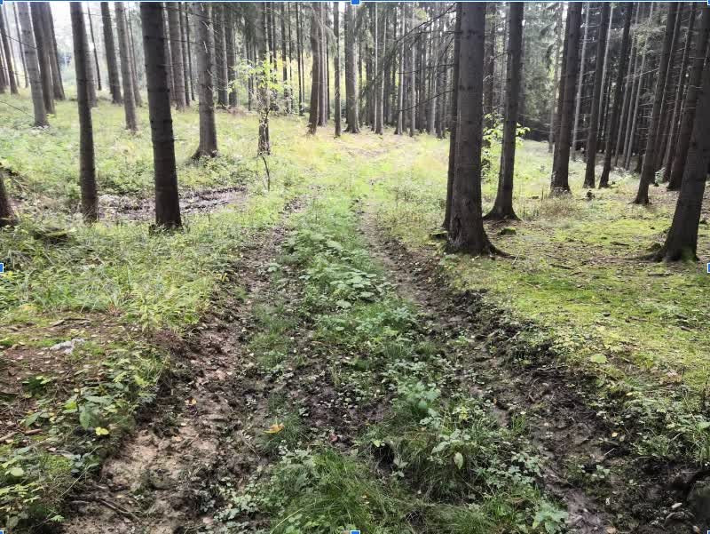

Vrstva bod Bod
používáme v případě, že chceme zachytit bodově charakter cesty, ale bez zjevné eroze či zahloubení.

Vrstva  - Linie 
Používáme v případě, že chceme zachytit charakter cesty, ale bez zjevné eroze či zahloubení. Linii cesty mapujeme u těch, které nejsou zakresleny v základní mapě.
Mapujeme lesní cesty, polní cesty, staré cesty, charakter křížení cest

Dokumentace
Zachycujeme cestu a charakter okolní krajiny. Ideálně foto do kopce a následně z kopce

Parametry
Šířka, materiál, stav

Komentář 
    nezpevněná
    zpevněná - štěrk (jemnější frakce), makadam (hrubší frakce), asfaltová (nová, rozpadající se atd.), kolejová (nová, rozpadající se)
    využití - staré cesty např. pro zasakování vody - v projektu se pak navrhnou hrázky a svedení vody z problematického místa (např. z vedle jdoucí cesty atd.)
# Cesty 
# C03. cesta stará Cesty
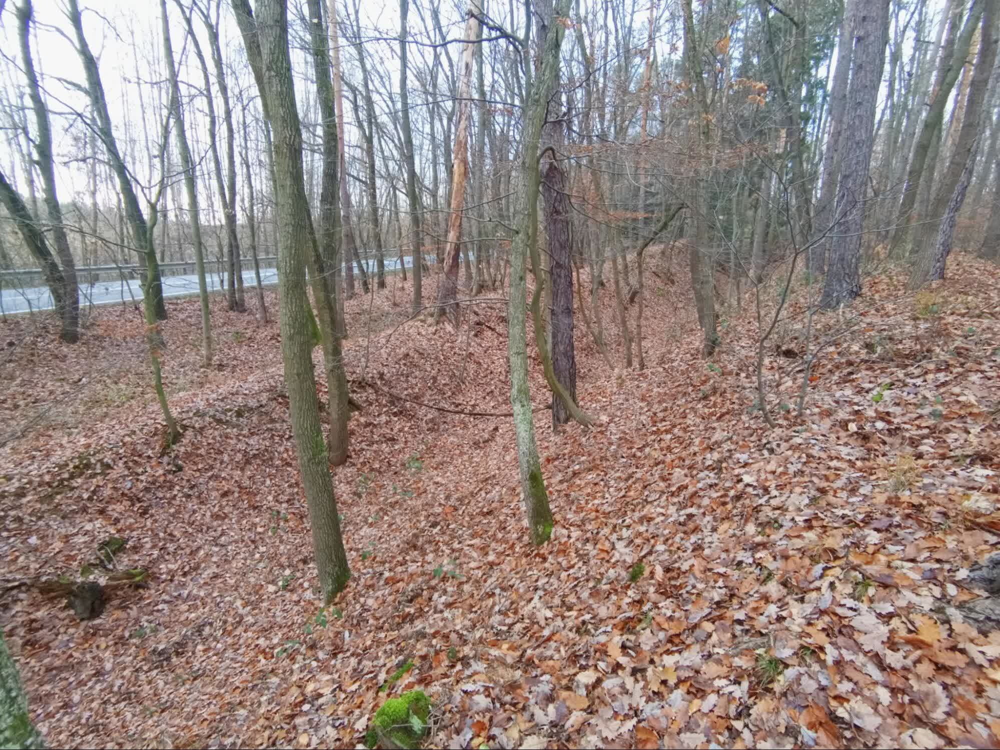

Vrstva
bod, linie

Charakteristika

mapujeme staré zaniklé cesty, ale které fungují jako odvodňující, či už v terénu je zřejmé, že je lze využít k zasakování vody. Nejčastěji můžeme pozorovat v lesích, kdy cesty vznikaly v místě náhodně a vedle sebe jich může být několik.
Dokumentace

Často se jedná o hluboké zářezy v terénu. V podstatě vznikaly tak, že v průběhu let byla cesta tak zerodovaná, že se již nedala využívat a začala objíždět. V polních tratích (narozdíl od lesů) se tyto cesty nejčastěji nedochovaly. Buď došlo k jejich zahrnutí v době HTÚP nebo sloužily jako smetiště až se zavozily a srovnaly. Protože jde často o hluboké zářezy a lze změť těchto cest lze pozorovat na DMR5G mapách. Je ale možné je zaměnit s občasným vodním tokem, proto v terénu je nutné tento fakt ověřit.

Příklad Fotka1
Síť cest, několik vedle sebe vedoucích, bez eroze, hloubka 3-5 m
# Cesty 
# C04. lávka Cesty
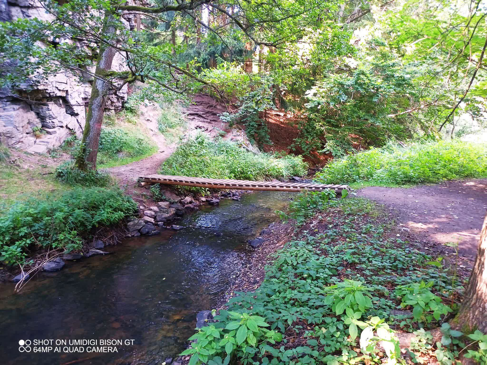

Vrstva
bod

Charakteristika
Přechod přes vodní tok, kterým není most. Jedná se nejčastěji o drobné stavby ze dřeva, klád, často nebývají v mapách, protože jde o místní přechody. Obecně lze říci, že se jedná o přechod jen pro pěší. 
Do této skupiny patří i přechody inženýrských sítí (plynovody, teplovody atd.) přes vodní tok.
Patří sem i zřízené lávky kolem vodních toků při břehu nebo stěně.

Dokumentace
Fotíme především boční pohled pro představu jak je velký prostor pro průtok vody (výška nad hladinou a přídle charakteru lávky, boční pohled případně pohled shora na povrch lávky

Parametry 
Dokumentujeme stav, materiál, výšku nad vodní hladinou a celkovou délku lávky.

Komentář 
    • nezpevněný
    • zpevněný štětováním, rovnaným kamenem, betonový, kamenivo zpevněné betonem
    • případně specifikujeme další zajímavosti

Priklady
Obrazek 1
Dřevěná, kulatina s deštěním, usazena na rovném povrchu, šířka 0,9 m, délka 6m, ode dna 1,5 m, koryto náhonu 

Obrazek 2:
Železobetonová lávka, betonové patky, šířka 1,2m, délka 8 m, výška ode dna 0,9 m
# Cesty 
# C05. most Cesty
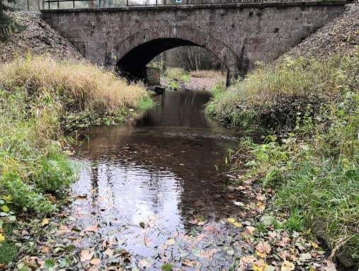

Vrstva
bod

Charakteristika
Na rozdíl od lávky most slouží k překonání vodního toku auty. 
Dokumentujeme charakter mostu, materiál, kondici.

Dokumentace
Boční pohled, aby byl vidět charakter průtoku pro  vodu.

Parametry
Výška mostu ode dna, šířka mostu - důležité pro stanovení kapacity mostu.
    • Most
        ◦ Konstrukce
        ◦ Materiál
        ◦ Rozměry
        ◦ Stav
        ◦ Přejezdnos
# Cesty 
# C06. neexistující most Cesty
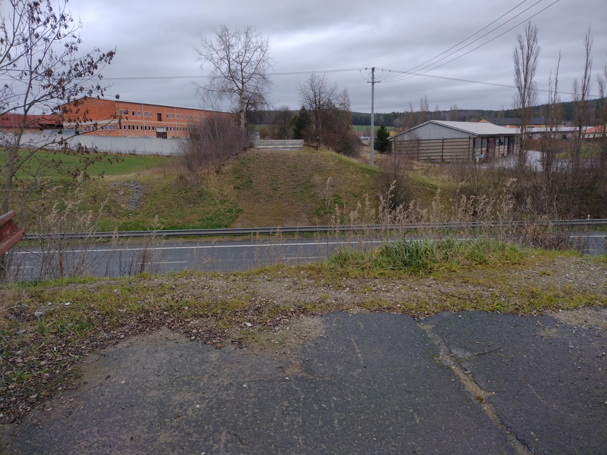

Vrstva
bod

Charakteristika
Jestliže v mapách je most uveden, ale ve skutečnosti neexistuje. Důležité pro výpočet hydromodelu, protože v takovém případě je o jednu překážku na toku méně. 

Dokumentace
Dokumentujeme stav, zda došlo k celkovému odstranění mostu záměrně nebo se jedná o samovolné zhroucení. Toto dokumentovat je důležité u mostků např v polních tratích, kdy mostky vznikaly během úprav VT v době HTUP. Tyto mostky se nevyužívají a dochází k jejich pozvolné destrukci. Totéž platí i v lesích.
	
# Cesty 
# C07. propustek Cesty
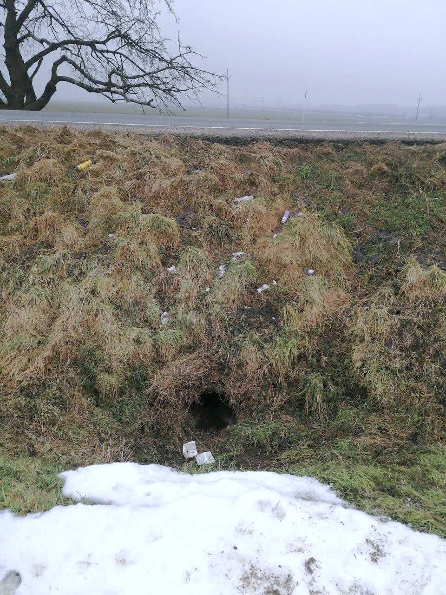

Vrstva
cesta - bod, linie

Charakteristika
Jedná se o stavbu k vedení vody pod úrovní cesty nebo náspem. Rozdíl mezi mostem a propustkem je průměr menší než 2 m. Propustky můžeme potkat na vodních tocích, kde převádí vodu z jedné strany na druhou nebo i v údolnicích, kde mají převádět jen dešťovou vodu. Mohou také sloužit k migraci živočichů.

Dokumentace, Parametry 
Vodnatost, šířka, výška, zanesení 
    • Propustek
        ◦ Průměr
        ◦ Délka
        ◦ Materiál
        ◦ Technický stav, zanesení

Příklady 
Foto 1
V údolnici včetně navedení příkopu podél cesty, šířka 0,3 m, materiál beton

Foto 2
 Převádění vody z údolnice a cestných příkopů, cesta 1. třídy, šířka 0,5 m, beton, výtoková strana, čistý  

Foto 3 
Propustek pod silnicí 1. třídy, na potoku, výška ode dna 1,3 m, profil V, šířka v patě 0,5 m, šířka v koruně 4 m, délka 8 m, čistý 

Foto 4
Na obslužné cestě, beton, 0,3 m, na odvodňovacím příkopu, výtoková strana, míra zanesení 80%, délka 5 m 

Foto 5
Propustek pod zastavěnou částí, svádí vodu z polí do potoka (z údolnice plus odvodňovací příkop na hranici zástavby a polí), beton, šířka 0,8 m, délka 60 m. V době dokumentace výrazně nepostačoval.
# Eroze 
# E00. nespecifikováno Eroze

# Eroze 
# E01. břehová nátrž Eroze
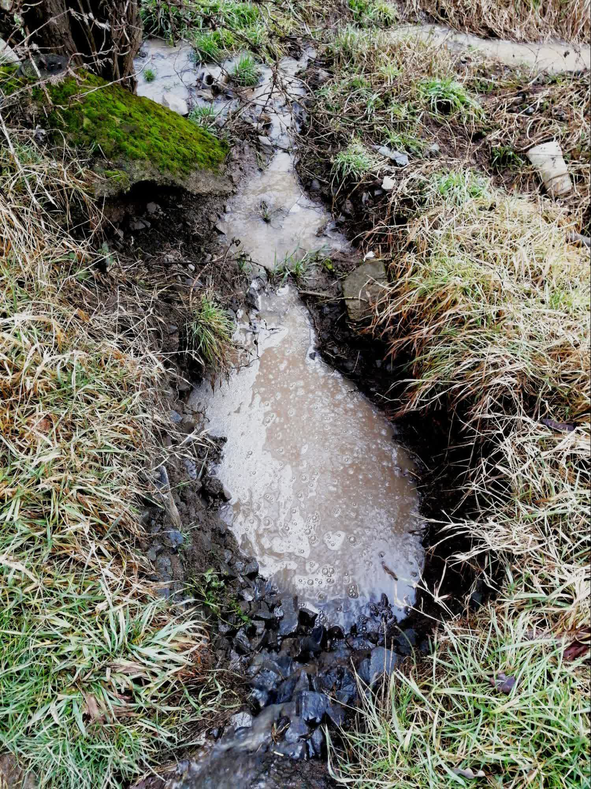

Vrstva 
bod

Charakteristika
Jedná se o erozi diky erozivním účinkům vody.  Nejčastěji v místě vnější strany oblouku toku, kde voda má větší energii a dochází k podemílání břehu až dojde sesunu materiálu. Oblouky se tak stále zvětšují a vznikají meandry. Mohou vznikat postupně, což vede k samovolné renaturalizaci toku nebo po menších či větších povodňových událostech.
Břehová nátrž může vzniknout i u technických prvků jako jsou hráze (přelivem vody přes hráz), rozlivem, při bodovém odtoku nezadržené vody v ploše povodí apod.

Dokumentace
Uvádíme přibližné rozměry, specifikaci kde se nátrž nachází, materiál ve kterém nátrž je.

Parametry 
Šířka, délka, hloubka, materiál.
# Eroze 
# E02. eroze plošná Eroze
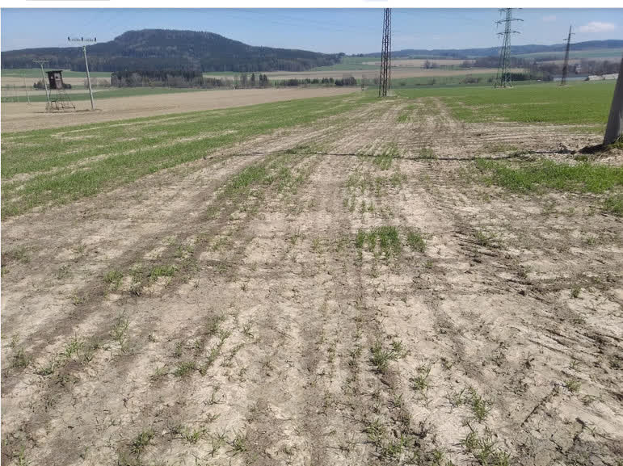

Vrstva
bod, linie, polygon

Charakteristika
Jedná se o druh eroze u kterého nemůžeme specifikovat jednotlivé erozní stružky nebo je erozí postihnuta celá plocha pozemku. Může jít i o kombinaci eroze plošné a stružkové, kdy stružka vede  v údolnici, ale plošnou erozí je zasažená okolní plocha pozemku. 
Do této vrstvy zanášíme i větrnou erozi, kdy opět zaznamenáme plochu odnosu částic. Může se jednat o menší plochy, ale také celé půdní bloky. 
Zaznamenáváme také zřetelně degradované půdy, které jsou jasně rozeznatelné v půdním bloku díky změně barvy, struktury, skeletovitosti (obsahu menších nebo větších kamenů) často na návrších a hřbetnicích.

Foto: do dáli, aby byl vidět charakter okolní krajiny

Parametry: 
    Šířka – šířka erozního smyvu v metrech
    Popis – délka eroze v metrech
# Eroze 
# E03. sesuv Eroze
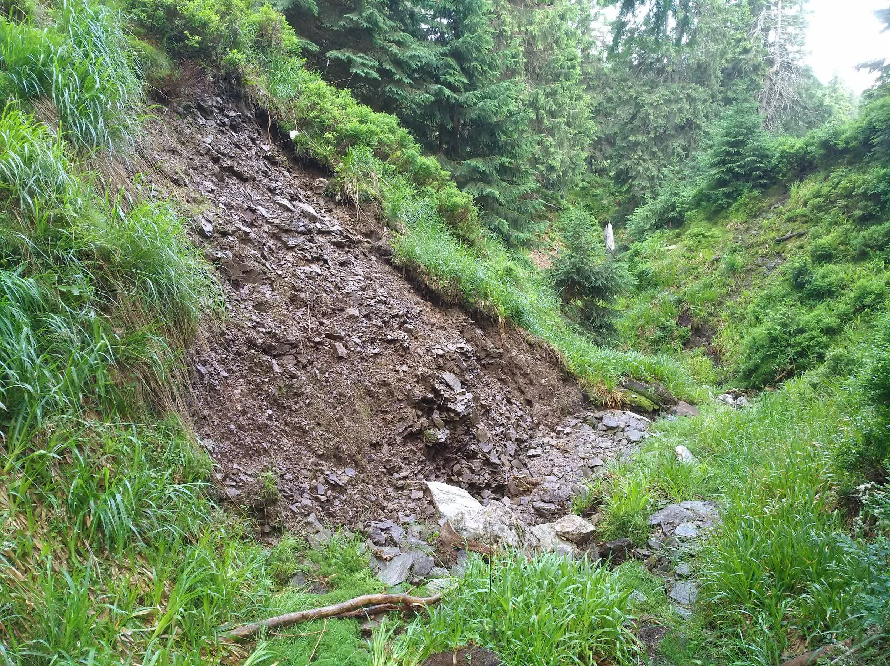

Vrstva
bod, linie, polygon

Charakteristika
Jde o geologický jev podmíněný podložím v oblasti. V případě, že dojde k narušení stability svahu v důsledku přírodních procesů, činnosti člověka nebo v případě, že se  svrchní část půdy nasytí vodou dojde k vzájemnému oddělení vrstev a svrchní část se sesune. 
Nejčastěji k tomuto jevu dochází v oblastech flyšového pásma, tj. Karpaty, Beskydy, také oblast Českého středohoří, české křídové tabule atd.

Dokumentace
Charakter okolní krajiny, detaily 

Bod
detaily

Linie
délka sesuvu  CO JE DELKA SESUVU

Polygon
zaměření sesunuteho masivu

# Eroze 
# E04. eroze stružková Eroze
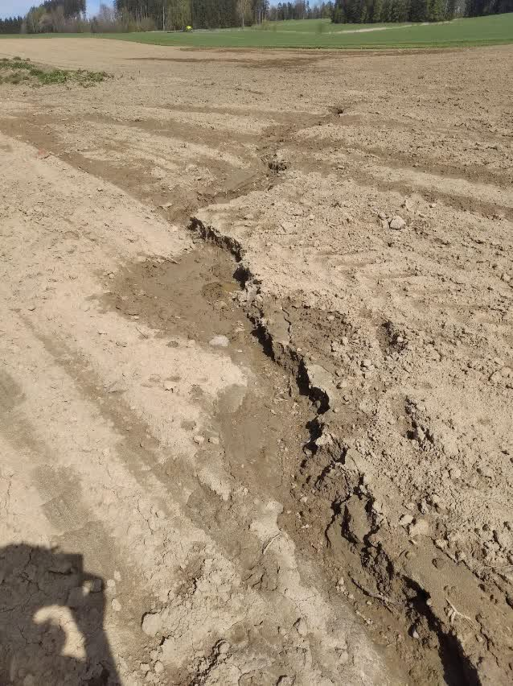

Vrstva: bod nebo linie

Charakteristika
Druh vodní eroze. Eroze je soustředěna do větší či menší stružky. 

Dokumentace
Nejčastěji  zaznamenáváme do vrstvy linie, do které vložíme tři foto - na počátku, v průběhu a na konci. Případně v bodech zaznamenáme nebo přidáme k linii další fotodokumentaci

Foto: do dáli, aby byl vidět charakter okolní krajiny

Parametry: 
    Šířka – šířka erozní rýhy
    Délka – délka erozní rýhy ( ubadime, pokud neuvedme presnou linii)
    Hloubka
    
# Eroze 
# E05. výplavový kužel Eroze
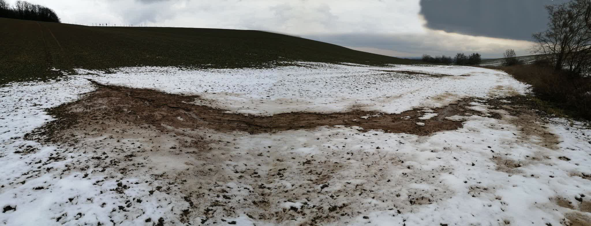

Vrstva
bod, linie, polygon

Charakteristika
Jedná se o spodní část vodní stružkové, ale i plošné eroze, čili kde eroze končí a dochází k uložení sneseného materiálu. Do stejné vrstvy zaznamenáme i deponii půdy při větrné erozi.
# Eroze 
# E06. mura Eroze

Vrstva
bod, linie, polygon

Charakteristika
Jedná se o splavení materiálu (zemina, kamení, štěrk, písek) při přesycení svahu vodou při  deštích.  Nejde o sesuv, ale  náhlé splavení povrchového materiálu - bahna, lesní hrabanky, půdy apod. Taky se nazývá bahnotok.

Parametry 
Šířka, délka, materiál 
# Eroze 
# E07. potvrzená trasa bleskové povodně Eroze

Vrstva
bod, linie

Charakteristika
Zaznamenáváme místními trasu povodně mimo dobu události. Nutné domapovat i průběh vod v intravilánu kudy voda odtekla až do vodního toku.

Dokumentace
Dokumentujeme trasu, buď do vrstvy linie nebo bodově. Ideálně fotit stejně jako vodní tok, tzn. průběžně s první foto proti směru, druhé foto po směru. Případně do linie foto na počátku, v průběhu a na konci.
# Jiné 
# J01. jiné Jiné
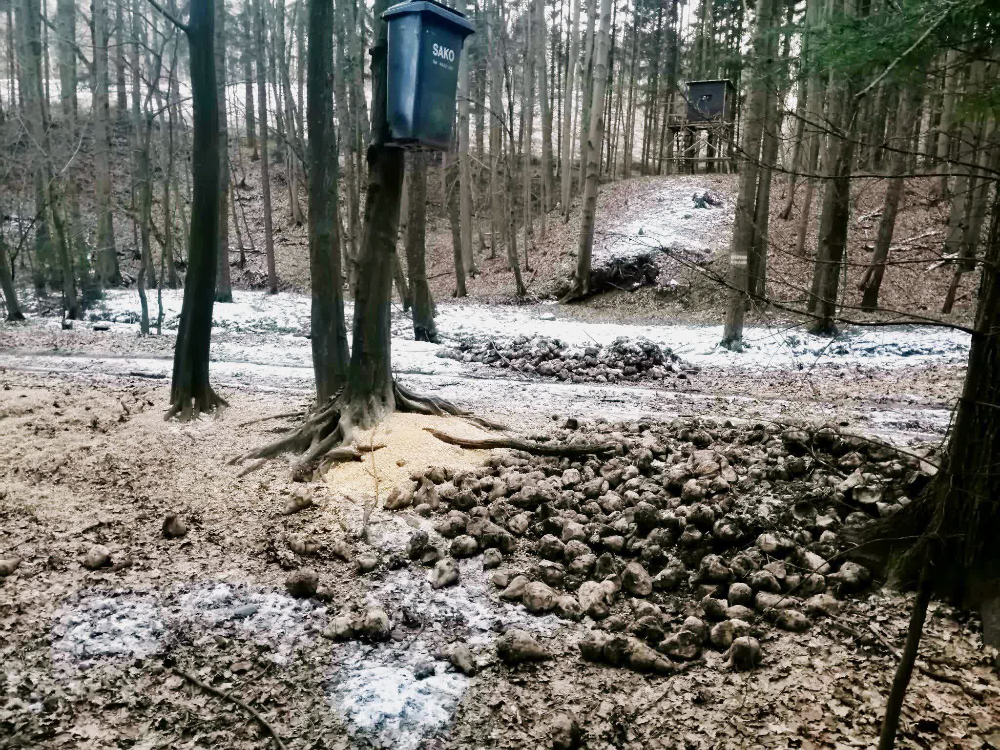

Vrstva
bod, linie, polygon

Charakteristika
Vkládáme různé prvky, které nelze zařadit do žádné kategorie, ale jsou v krajině celkem podstatné pro její charakteristiku, popis či jde o jiné různé zajímavosti. Můžeme fotit charakter krajiny, různé přírodní úkazy, také údolnice, apod.

Dokumentace
Parametry 
Relevantní k danému dokumentované mu prvku.

Příklady
Fotka 1
Popelnice na strome

Fotka 2
Obrosky neco v potoce

# Jiné 
# J02. lom Jiné

Vrstva
bod, polygon

Charakteristika
Místo získávání nerostného bohatství - kámen, štěrk, písek, jiné suroviny. Může jít o lomy aktivní i neaktivní. Lomy historické po získávání kamene můžou být vhodnými místy pro zasakování vody např. z kolem vedoucích cest, stejně tak často bývají ve dně neproustné a zdržujídestovou vodu nebo došlo k jejich zaplavení obnažením pramene.
Typem lomu je i tzv. hliniště, často zaznamenané v mapách stabilního katastru. Hliniště sloužila k získávání jílu na výrobu nepálených cihel. 
Pokud lomy nebyly zaplaveny vodou, často se staly místy ukládání domovního i stavebního odpadu.

Dokumentace

Parametry 
Hloubka, šířka, délka, materiál 
# Jiné 
# J03. manipulační prostor Jiné
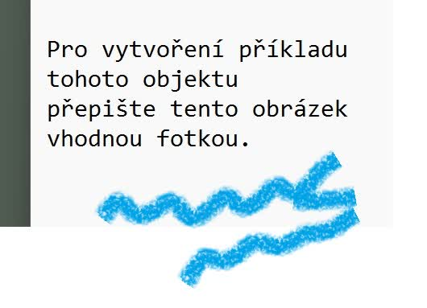

# Jiné 
# J05. paseka Jiné

# Jiné 
# J06. přibližovací linka Jiné
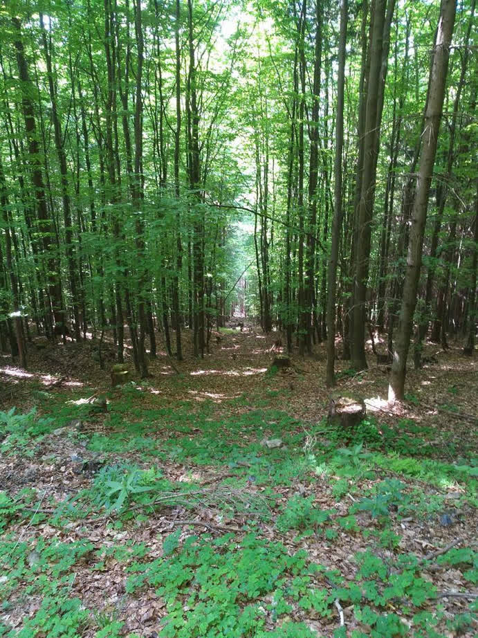

Vrstva
bod, linie

Charakteristika
V lesích jsou lesní cesty klasifikovány do 4. tříd (1L - 4L). Lesní cesta 1L je cesta pro celoroční provoz, vybavena vozovkou. Lesní cesta 2L je určena alespoň pro sezónní provoz, vybavená zpevněným povrchem (štěrk, šotolina, obrus apod.).
Cesta 3L je tzv. lesní svážnice, je přibližovací cesta sjízdná pro traktory, vyvážecí techniku i terénní auta. Jeji povrch může být zpevněný i nezpevněný. Měla by mít alespoň základní odvodňovací prvky (podélné i příčné).
Cesta 4L je tzv. technologická linka jejíž povrch je nezpevněný, vedou povětšinou po spádnici a slouží pouze ke stahování dřeva, často je nárazové v době obmýtí. 
Pro naše studie jsou důležité cesty třídy 3L a 4L, protože se jedná o plochy utužené a často fungující jako svodnice pro dešťovou vodu. Obzvláště po kůrovcové kalamitě je těchto svážnic najednou využito jedné lokalitě v krátkém časovém úseku velké množství a proto je nutný jejich monitoring a jejich včasná sanace.

Dokumentace
Dokumentujeme stav, 
Parametry 
Šířka, materiál (povrch), stav
# Jiné 
# J07. skládka stará zátěž Jiné

Vrstva
bod, polygon

Charakteristika
Jde o úložiště jakéhokoliv odpadu. Skládky často vznikaly spontánně jako zavážky vhodných lokalit - staré lomy, úvozy, strže, různé prolákliny a sníženiny v terénu, dokonce i přírodní útvary. Pak se mohl odpad zahrnout zeminou. Staré skládky můžeme najít v lesích (lomy, strže), ale i polích (úvozy). Postupně může docházet k jejich obnažování a rozplavovaní materiálu. Lze říci, že každá vesnice má takové místo.
Dnes se jedná o plochy dobře dostupné autem a odlehlé.

Dokumentace
Dokumentujeme plochu, druh materiálu, zda se jedná o skládku rekultivovanou - zavezenou a osázenou, apod. 
Do vrstvy polygon zanášíme obchůzkou obvodu plochu skládky.

Parametry
Šířka, materiál (povrch), stav
# Jiné 
# J08. strom Jiné
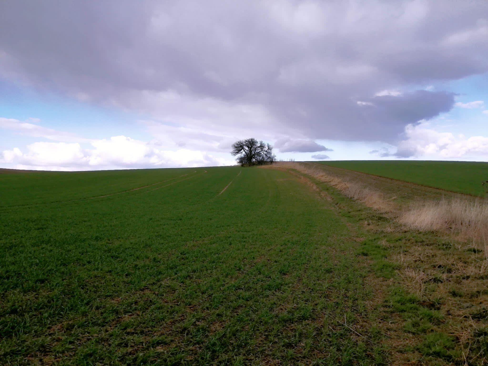

Vrstva
bod

Dokumentace
Celkový pohled na strom, jeho habitus, charakter okolní krajiny. V detailu zachytit např. list nebo v době vegetačního klidu mladou větev a pupeny, případně opadlý list.

Parametry 
Výška, popis (uvést druh a čím je výjimečný)
# Jiné 
# J09. strž Jiné
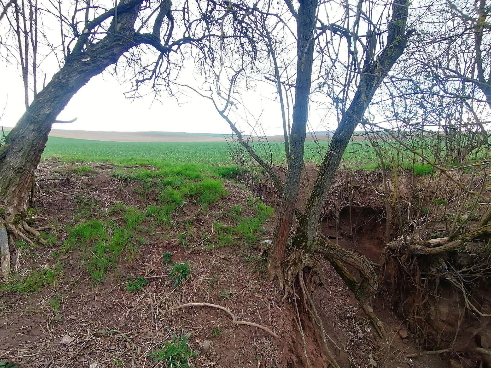

Vrstva
bod, linie

Charakteristika
Strže jsou erozní rýhy různých rozměrů. Často vznikají díky lidské činnosti nebo jako průvodní jev vodní eroze na nezpevněných či odhalených plochách. 
Strž je nejčastěji profilu tvaru V. Mohou být suché, když vznikají při odvodu vody z jiných ploch v průběhu času, často se s tím můžeme setkat v případě vyústění meliorace na nevhodném místě. Může docházet až k tzv. zpětné erozi, kdy voda vytékající z trubky podemílá trubku samotnou a odpadávají jednotlivé části trubek a vyústění se tak vlastně posunuje a dochází pod vyústěním dochází k tvorbě strže. Často vznikaly v místech starých cest, tzv. úvozových cest, což bývá problém z hlediska povodňových rizik, jelikož tak povrchové vody navádí přímo do zastavěného území. 
Strže mohou vznikat i v případě odtoku velkého množství povrchové vody v době přívalové povodně, například nejspodnější části zemědělského půdního bloku. 
Strže se mohou v případě pravidelného i nepravidelného přístupu vody stále vyvíjet. Typické je uložení výplavového kužele pod strží.

Strže se rozdělují na dva typy a to ovrag a balka. Strž ovrag má nestabilní svahy, je výrazně ve tvaru V. Strž typu balka má dno vyplněné sedimenty a naplaveninami.

Dokumentace
Dokumentujeme profil, množství suti ve dně strže. 
Jedná-li se o strž historickou, nemusí se zaměřovat její linie, ale pořizujeme fotodokumentaci do vrstvy Bod, jelikož její trasa je shlédnutelná z map DMRG.
Jde-li o strž vzniklou v důsledku povodňové události je nutné zaměřit i její linii. Samozřejmostí je dokumentace výplavového kužele.

Parametry 
Hloubka, materiál (uloženého ve dně strže a jeho pevnost), podrost, šířka v koruně, šířka v patě, vodnatost, zaplnění v procentech
# Jiné 
# J10. zeď Jiné

#  Meliorace, Odvodnění 
# M00. Odvodnění - nespecifikováno  Melio - Odvod

#  Meliorace, Odvodnění 
# M01. odvodňovací strouha  Melio - Odvod
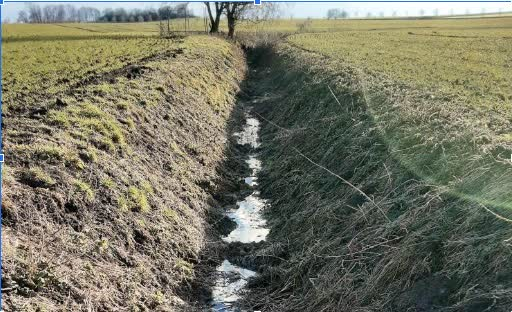

Vrstva: bod nebo linie

Charakteristika
Narozdíl od kanalizovaného vodního toku je odvodňovací strouha prvek čistě k odvádění vody. Nejčastěji se jedná o příkopy třeba na hranici zahrad a ZPF jako ochrana pozemků a obydlí před záplavou při extrémních srážkách nebo za účelem vyústění meliorací. Na rozdíl od svejlu neslouží k zasakování, ale odvodňovací příkop dále vede k nejbližší vodoteči. V mapách je veden jako HMZ nebo VMZ.

Foto: po směru odtoku

Dokumentace
Dokumentujeme charakter krajiny, kde je strouha uložená (v údolnici, na okraji ZPF, u cesty atd.)
Každých cca 200m nebo při významné změně charakteru.

Parametry: 
    Vodnatost - v l/s nebo slovně
    Hloubka – hladina vody
    Šířka v patě – spodní šířka koryta v patě v metrech
    Šířka v koruně – horní šířka koryta v koruně v metrech
    podrost
#  Meliorace, Odvodnění 
# M02. šachta  Melio - Odvod
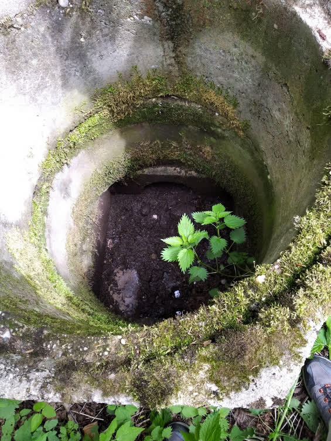

Vrstva: bod

Charakteristika
Kontrolní, revizní, čistící 

Foto: dovnitř šachty nebo z venku s okolní krajinou

Parametry:
    Vodnatost
    Šířka, v geodezii prumer, v geodezii je značka šachta
    Stav
    Zaplnění v procentech
#  Meliorace, Odvodnění 
# M03. šachta zasypaná  Melio - Odvod

#  Meliorace, Odvodnění 
# M04. tok upravený otevřený nebo kanalizovaný  Melio - Odvod
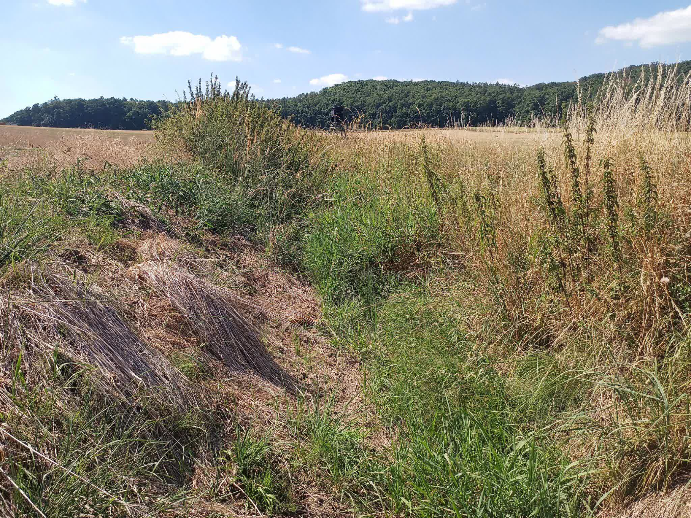

Vrstva
bod, linie, polygon

Charakteristika
Jedná se především o toky, které byly v minulosti prohlubovány a narovnávány. Nejčastěji se jedná o toky v polních tratích, kde potok vůbec neexistoval, ale toky se spíše podobaly zamokřeným nejnižším plochám s velmi pomalu proudící vodou. Dnes jsou tyto potoky zahloubené 1 - 1,5 (1,7 m), narovnané. K tomuto bylo přistupováno nejen z důvodu samotného odvodnění takové údolnice, ale i k možnosti vyústění meliorací z okolních širších ploch. Často jsou ve vodoprávních mapách vedeny jako HMZ nebo VMZ.

Bod
zaznamenáváme charakter vodního toku, ideálně průběžně po cca 200 m, první foto proti směru toku, druhé foto po směru toku.

Linie
zaznamenáváme linii toku neznačeného v mapách. 

Dokumentace
Zaznamenáváme celkovým pohledem charakter koryta nejprve proti proudu a pak po proudu. Ideální je foto zaznamenané z koryta. Tak je zřejmé tvar a zahloubení i materiál dna. 

Parametry 
Vodnatost, Hloubka (výška hladiny vody ode dna), šířka v patě (šířka dna), šířka v koruně (horní šířka koryta).
    • Vodní tok
        ◦ Charakter koryta (opevněné/přírodní)
        ◦ Příčný profil
        ◦ Hladina vody v korytě
        ◦ Technický stav koryta, zanesení
        ◦ Blízké okolí vodního toku
#  Meliorace, Odvodnění 
# M05. tok zatrubněný  Melio - Odvod
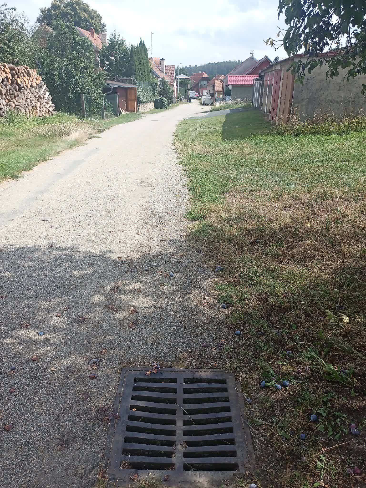

Vrstva
bod, linie

Charakteristika
Tok převedený v potrubí v delší úsek (nejde o propustek). Často se jedná o úseky v zastavěném území, kdy se toky zatrubnily z prostorových důvodů - tok vedl uvnitř husté zástavby. Často k tomuto zásahu vedly i hygienických důvody. kdy vodní toky začaly sloužit jako kanalizační stoky (doba splachovacích záchodů.

Dokumentace
Dokumentujeme trasu zatrubnění, často se liší oproti projektům. Nejčastěji sledujeme kanalizační vpustě, kterými jsou odváděny dešťové vody ze zpevněných ploch. Dokumentujeme první obrázek proti směru toku, druhý po směru, třetím obrázkem ideálně pohled dovnitř.

Bod
dokumentujeme vpustě.

Linie
Zaznamenáváme počátek a konec zatrubnění. Spojujeme jednotlivé vpustě nebo zaznamenáváme směr potrubí je-li možné shlídnout. 

Parametry 
Vodnatost, materiál, šířka (průměr), výška, hloubka, stav
Do popisu lze uvést čistotu vody apod. 
#  Meliorace, Odvodnění 
# M06. trubka odtok ze šachty  Melio - Odvod

Vrstva
bod, linie

Charakteristika
Jedná se o odtokové potrubí melioračního systému z kontrolní šachty. Zpravidla odtoková trubka bývá většího průměru než přítokové (vodítko v případě, že je šachta suchá) nebo narozdíl od přítokových trubek není žádný nános jemné zeminy nebo nárůst organismů.
Nejdůležitější dokumentací je směr hlavníku. Roury byly z šachet vedeny kolmo, ojediněle se může stát že šikmo. 
Středem šachty zaměříme počáteční bod, shlédneme směr vedení hlavníku a konec linie zaměříme 10 - 20 m od šachty. To je důležité v případě, že není možné dohledat meliorační plány a tak lze určit směr hlavníku. Stejně tak je tato informace nápomocná při georeferencování. 

Dokumentace
Parametry 
vodnatost, materiál, šířka (průměr), stav
#  Meliorace, Odvodnění 
# M07. trubka poškozená  Melio - Odvod

Druh: Trubka poškozená

Charakteristika
Jakákoliv poškozená trubka meliorací či jiného druhu odvodnění. U meliorací se jedná o vytvořené kaverny či nahromaděné trubky, poškozené zatrubnění toku či dešťové kanalizace.

Dokumentace
Charakter okolní krajiny a detail poškození

Foto
detail a místo s charakterem okolní krajiny

Parametry:
    Šířka: průměr prasklé trubky v metrech
    Vodnatost
#  Meliorace, Odvodnění 
# M08. trubka přítok do šachy  Melio - Odvod
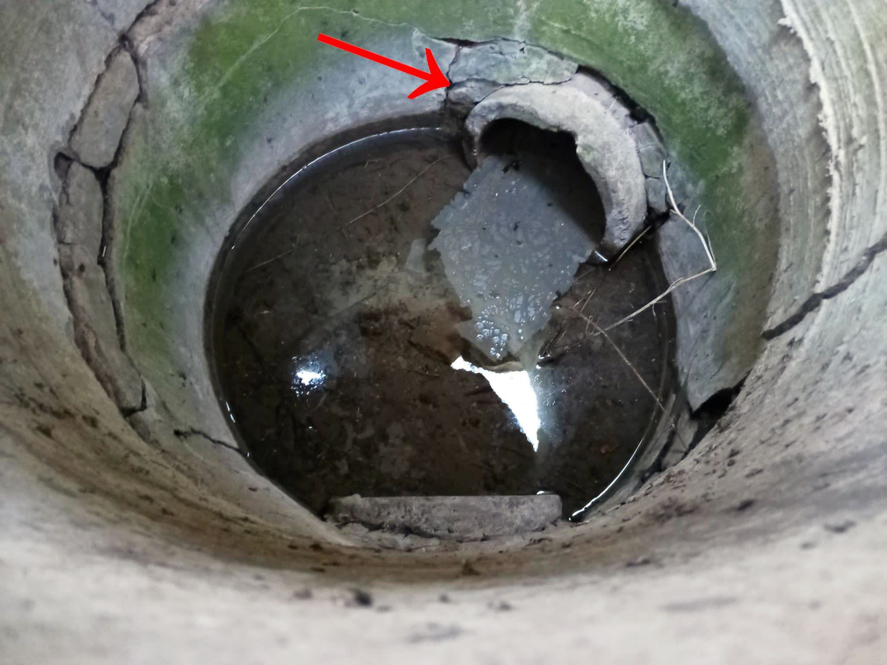

Vrstva
bod, linie

Charakteristika
Jedná se o přívodní potrubí melioračního systému do kontrolní šachty. Zpravidla přítoková trubka bývá menšího průměru než odtoková (vodítko v případě, že je šachta suchá) nebo bývá u trubky náznak nánosu jemné zeminy nebo důlek v zemině po čůrku vody.
Nejdůležitější dokumentací je směr hlavníku. Roury byly do šachet vedeny kolmo, ojediněle se může stát že šikmo. 
Středem šachty zaměříme počáteční bod, shlédneme směr vedení hlavníku a konec linie zaměříme 10 - 20 m od šachty. To je důležité v případě, že není možné dohledat meliorační plány a tak lze určit směr hlavníku. Stejně tak je tato informace nápomocná při georeferencování. 

Dokumentace
Celkový pohled do šachty.

Parametry 
vodnatost, materiál, šířka (průměr), stav
#  Meliorace, Odvodnění 
# M09. výusť odvodnění  Melio - Odvod
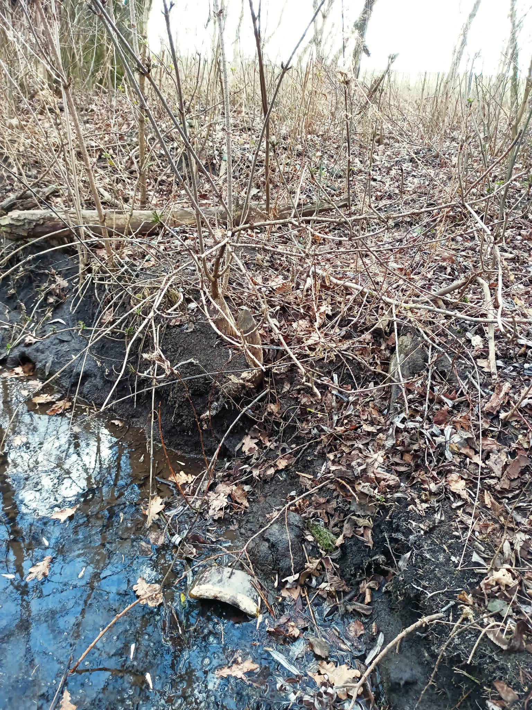

Vrstva: bod

Charakteristika
Jde o vyústění melioračních systémů. Nejčastěji uložené ve vodních tocích nebo odvodňovacích kanálech zbudovaných pro tento účel. Často jsou vyústění umístěná přímo do pramenu, kdy bylo odvodněno prameniště a nyní se mylně vyústění pokládá za pramen. Někdy se s vyústěním je možné setkat i přímo v příkopech u silnic.
U vyústění je nutné připojit i linii směru hlavníku. Nejlépe do vyústění strčit hůl či klacek a poodstoupit o několik desítek metrů tím směrem a zaměřit ve vrstvě „trubka přítok do šachty”. To je důležité v případě, že není možné dohledat meliorační plány a tak lze určit směr hlavníku. Stejně tak je tato informace nápomocná při georeferencování. 

Dokumentace
detail dokumentující stav, materiál, zacensení, vodnatost + celkový pohled uložení v příkopu a charakteristika okolí

Příklad
Vyustění zachycují dvě fotky, detail a jeho okolí. V příkladu jsou dvě vyústění.

Parametry: 
    Vodnatost - v l/s nebo slovně
    Materiál
    Šířka – průměr při kruhovém tvaru
    Stav
#  Meliorace, Odvodnění 
# M99. horská vpusť  Melio - Odvod

Vrstva
bod

Charakteristika
Jde o většinou betonové prefabrikáty přes celou šířku silnice a plně zapuštěné ve vozovce. Horní část je opatřen mříží sloužící k usměrnění vody a zachycení spláví ve svazích o větší sklonitosti nebo většího povodí. Voda je usměrňována odtokovým otvorem nejčastěji do kanalizace  a splaveniny se v pusti akumulují. Z tohoto důvodu je nutné jejich pravidelné čištění. 

Dokumentace
Záběr vpustě s pohledem proti směru toku vody i s okolím.
Detail zanesení 

Parametry 
Šířka, délka, hloubka, zanesení v procentech, hrubost akumulovaného materiálu (např. Hrubý štěrk, písek, dřevo, atd.)
# Vodní pr. 
# V00. Vodní prvky - Nespecifikováno Vodní pr.

# Vodní pr. 
# V01. akumulace balvanů Vodní pr.
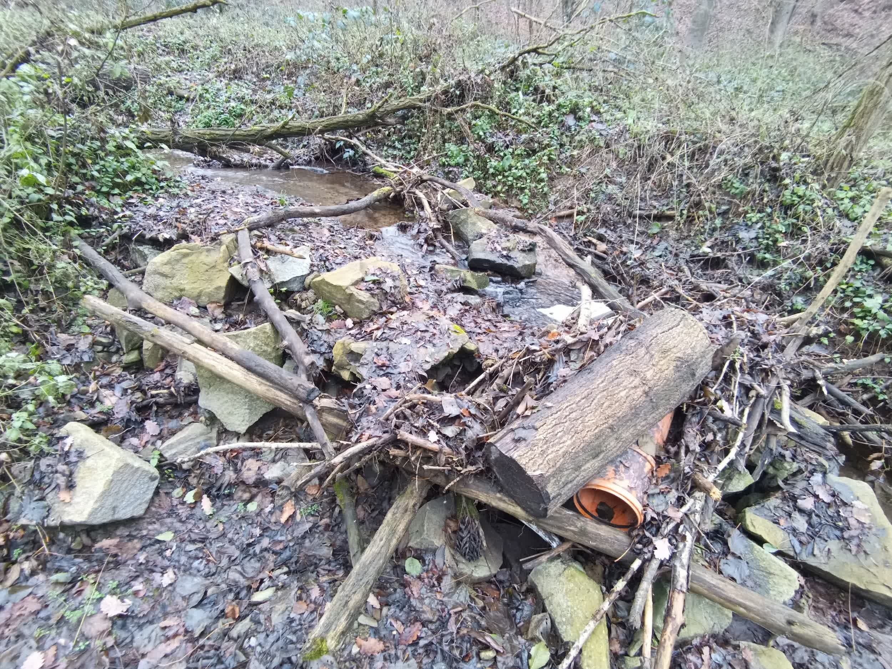

Vrstva 
bod, polygon

Charakteristika
Jedná se o akumulaci balvanů (hromadění) v toku přemisťovaných vodním tokem při vyšších průtocích. Dochází k tomuto nejčastěji u horských toků na vhodných místech, především pak v dolních úsecích toku nebo před nějakou překážkou, ať už technickou pro tento účel vytvořenou (záchytnou sítí, přehrážkou) nebo přírodní (kameny, větve, skalní bloky, vývraty). 
Zdrojem balvanů může být vlastní koryto, tedy díky přirozené morfologii koryta. Ale také to může být technická úprava, která podlehla vlivu průchodu povodně. 

Dokumentace
velikost akumulace, uložení vůči toku (v celé šíři koryta, při břehu, uvnitř koryta).

Parametry
výška, délka, šířka, materiál - velikost balvanů, poměr frakce - pouze balvany, směs hrubého štěrku a balvanů, dnes pláví a balvanů…
# Vodní pr. 
# V02. akumulace sedimentu Vodní pr.
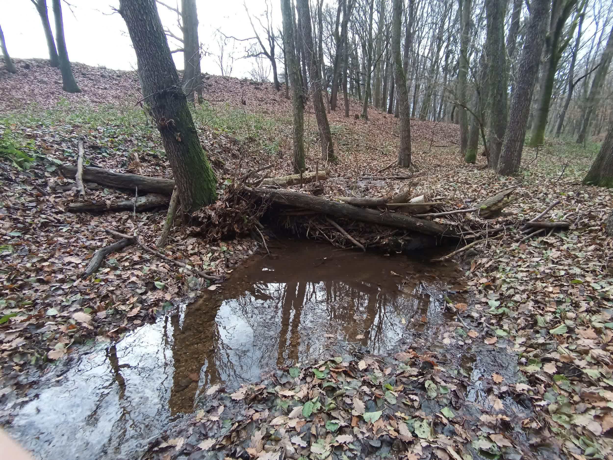

Vrstva 
bod, polygon

Charakteristika
Místo ukládání sedimentu unášeného vodním tokem. Jde o plaveniny a splaveniny.
Plavenina (nebo spláví) na materiál vnášený do toku z okolí, tj. erodovaná ornice, větve, kmeny, odpadky.
Splaveniny jsou přirozený materiál koryta vodního toku unášeného proudem. Splaveniny jsou výrazným prvkem, který utváří charakter koryta a ovlivňují povodňové události. Především v oblastech s typickou geologickou skladbou jako jsou flyšová pásma Beskyd je množství a pohyb splavenin rizikovým faktorem. 

Akumulace sedimentu je vždy výrazná v korytech s menším spádem (dolních úsecích toku), případně oblastech s výrazným kolísáním hladiny a rychlosti toku a vhodných geologických podmínek.
K akumulaci sedimentu dochází před nějakou překážkou, ať už technickou pro tento účel vytvořenou (záchytnou sítí, přehrážkou) nebo přírodní (kameny, větve, skalní bloky, vývraty). 

Parametry
výška, délka, šířka, materiál - velikost balvanů, poměr frakce - pouze balvany, směs hrubého štěrku a balvanů…
# Vodní pr. 
# V03. balvanitý skluz Vodní pr.
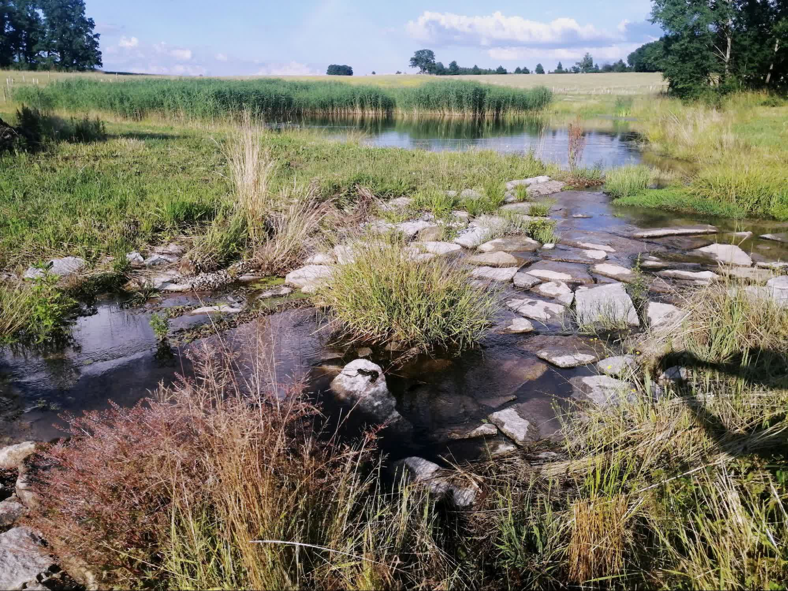

Vrstva 
bod

Charakteristika
Jde o příčný objekt na vodním toku, který vyrovnává větší sklon toku. Stejnou funkci mají i prahy, hrázky apod., ale balvanitý skluz se nejvíce podobá přírodním útvarům. Voda klouže po jejich povrchu a z hlediska migrace živočichů je nejméně narušující.
Setkat se s balvanitým skluzem můžeme jak ve vodních tocích, tak i u vodních ploch, např tůní, kde hrázku nahrazuje tento skluz.
# Vodní pr. 
# V04. mokřad Vodní pr.
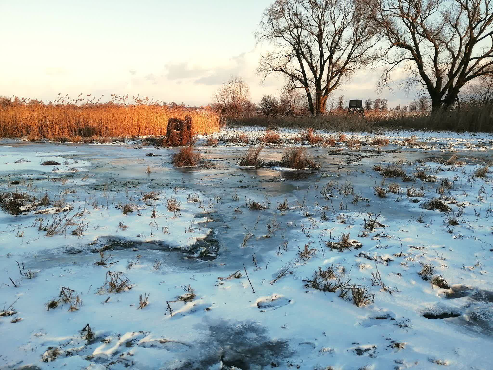

Vrstva
bod, polygon
Charakteristika

Pro naše účely se mokřadem rozumí plocha s vysokou hladinou podzemní vody a to buď trvale nebo sezóně. Vyznačují se na rozdíl od zamokřených ploch výskytem mokřadních rostlin a společenstev. Na ZPF se zde vzhledem k množství naplavených živin a občasnému kultivování často vyskytuje šťovík alpský, lopuch větší. V lesích pak sítina rozkladitá.
Mokřadem může být menší či větší plocha s půdou jen vysoce nasycenou vodou, ale i s určitou výškou hladiny. Mokřady se vyskytují jak v nivách potoků a řek, tak i v plochách zemědělských pozemků i lesa. 

Dokumentace
Dokumentujeme charakter mokřadu, výskyt rostlin, charakter okolí, případně zdroj vody - zda jde o zamokřenou nivu potoka, zdrojem může být i vodárenský vrt, vyústění meliorace, nebo i vodní tok, je-li například samovolně vybřežený.

Parametry 
Vodnatost, podrost (rostliny, živočichy), šířka, délka
# Vodní pr. 
# V05. opevnění břehu Vodní pr.
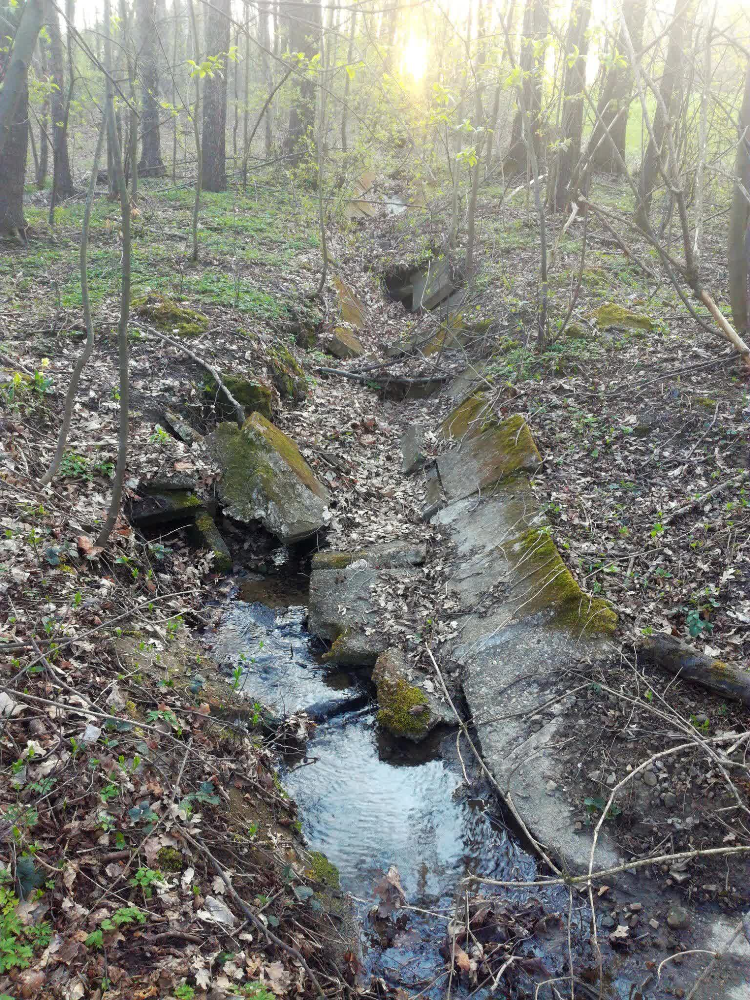

Vrstva
bod, linie

Charakteristika
Jedná se o technickou úpravu koryta. Rozlišujeme o jaký druh se jedná, protože každý materiál i způsob uložení má jiný vliv na rychlost vody v korytě. 
Lze rozdělit na vegetační, polovegetační a nevegetační. 

Dokumentace
Zaznamenáváme z důvodu rozdílného vlivu použitého materiálu na rychlost vody. Členité koryto bude mít na vody spíše zbržďující vliv, kdežto v korytě obloženém betonovou dlažbou nebo železobetonovými deskami bude voda naopak zrychlovat.

Parametry 
Vegetační opevnění je zpevnění břehů pomocí vegetace - trávy, keřů, stromů

polovegetační opevnění je opevnění technického rázu provedené s pomocí vegetace - zatravňovací prefabrikáty, dřevěné plůtky a sruby, drátokamenné matrace, sítě.

nevegetační opevnění je pak opevnění kamenné v různé míře zpevněné
Pohoz
Zához
Rovnanina suchá
Kamenná dlažba suchá - skládané kameny do štěrkového lože se spárou vysypanou štěrkem
kamenná dlažba s cementovou spárou - vyskládaná do štěrku pouze se zpevnou spárou
Kamenná dlažba do betonu - kameny rovnané na beton se zalitou spárou
Betonová dlažba
Betonové a železobetonové desky
# Vodní pr. 
# V06. náhon Vodní pr.
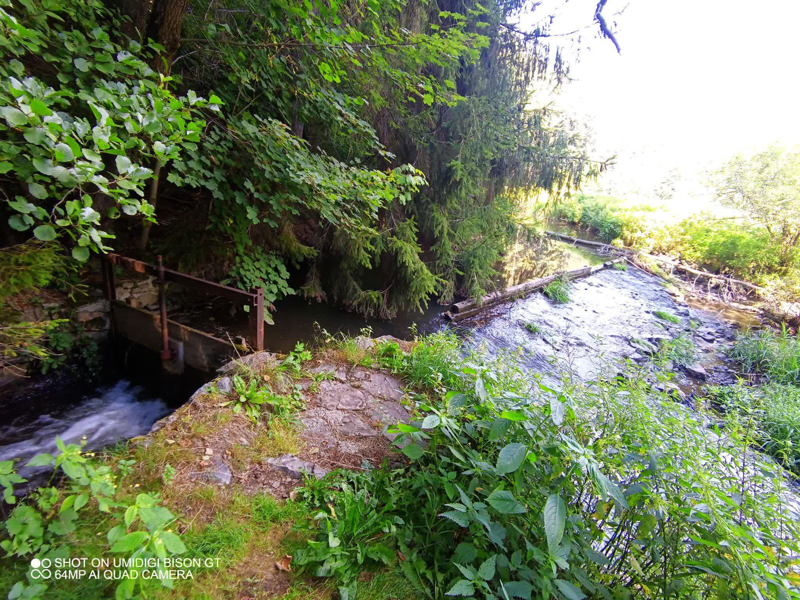

Vrstva
bod, linie

Charakteristika
Uměle vytvořený kanál na toku pro účely převedení vody na určité technické zařízení jehož hybnou silou má být voda. Náhon začíná jezem nebo hrází s možností regulace při vyšších nebo nižších průtocích. Součástí náhonu může být i rybník, který sloužil jako rezervoár vody v suchých obdobích. 
Náhon se využívá nebo využíval u mlýnů, hamrů (kovárny), elektráren, ale i jako plavební kanály pro plavení dřeva. Případně může jít o jiné vodní cesty převádějící vody na jiné místo.

Dokumentace
Parametry 
Vodnatost, Hloubka (výška hladiny vody ode dna), šířka v patě (šířka dna), šířka v koruně (horní šířka koryta).

Bod
stejně jako u vodních toků průběžně dokumentovat stav a charakter od počátku s dokumentací druhu regulace VT a stavu.

Linie
v případě nezakresleného náhonu v mapách je nutné zmapování jeho trasy.
# Vodní pr. 
# V07. plocha pro rozliv Vodní pr.

V dokumentaci též PřívalováBlesková povodeň rozliv

Vrstva 
Polygon

Charakteristika
Jde o plochu, kde dochází k vybřežení potoka a rozlivu vody mimo jeho koryto. Může jít jak o plochu nivy mimo zastavěné území, tak i o nivu uvnitř intravilánu. 
K rozlivu může docházet z několika příčin:
místo, kde se mění příčný spád koryta, tzn. ze svažitého na rovnější. 
místo, kde dochází k přeplnění koryta náhlým množství vody (např. v obci ze zpevněných ploch), které koryto v závislosti na protékajícím množství vody už není schopno pojmout
Na toku se nachází překážka - malokapacitní propustek, most, nahromadění spláví a splavenin či jinak náhle omezený průtok.

Dokumentace
Dokumentujeme místo, snesený a usazený materiál, příčinu rozlivu. Je nutné v rámci monitoringu definovat zdroj přívalovébleskové povodně.
# Vodní pr. 
# V08. poldr Vodní pr.

Vrstva
bod, linie, polygon

Charakteristika
Jde o suchou nebo občasně částečně zaplavenou uměle vytvořenou plochu pro zadržení vody při vysokém stavu vody nebo pro zachycení záplavových vod nejčastěji ze ZPF. Poldr má nátokovou stranu a hráz s vypouštěcím zařízením, které má omezený průtok. Poldr nemá za úkol vodu zadržovat, ale jen díky omezené vypouštěcí kapacitě vodu pozdržet. Nejčastěji se zřizují v nejspodnějším možném místě nad zástavbou. 

Parametry 
Linie: zaměřit linii hráze - hloubka (uložení výtokového zařízení), šířka v patě, šířka v koruně, výška, stav, zaplnění v procentech, do popisu uvést zanesení dna poldru
# Vodní pr. 
# V10. práh toku Vodní pr.

Vrstva
bod

Charakteristika
Jedná se nízký stupeň na vodním toku. Slouží jednak k vyrovnávání výškového rozdílu toku a zmírňuje tak rychlost proudění vody. Pomáhá také k ochlazování a prokysličování vody. Ideálně, když nahrazují spádové stupně. 

Migračně je práh na toku velmi příznivý.
Nejčastěji se zhotovuje z dřevěné kulatiny, případně kamene. Vývar vody pod prahem je vždy nasypán nebo vyložen z kamene. Jeho zřízení vyžaduje stavební zásahy do břehů.

Dokumentace
Parametry 
Výška, materiál 
# Vodní pr. 
# V11. pramen Vodní pr.
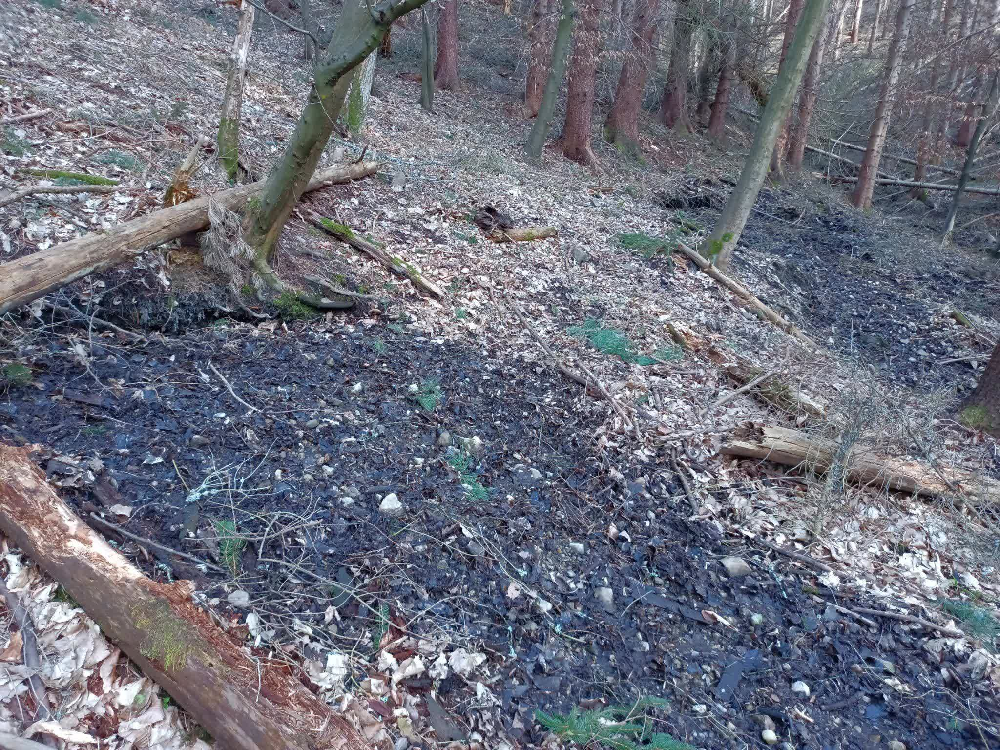

Vrstva
bod

Charakteristika
Jde o bod, kde voda vyvěrá na zemský povrch. Za příznivých podmínek se z pramene stává vodní tok. 
Voda nemusí jen zřetelně vyvěrat, ale i jen prosakovat a pak jde o tzv. prosak. 
Prameny se mohou vyskytovat jak v údolích, tak i ve svazích a to jak v lesích, tak i na ZPF. Prameny se mohou vyskytovat nejen na počátku VT, ale i v průběhu, nejčastěji pak zavodňují nivu potoka a stávali se často objekty odvodňování.
Jestliže nad vodní plochou rybníka, jezera nebo jiné vodní nádrže nenalezneme žádný přítok, ale z vodní plochy odtéká voda přepadem, pak se jedná o tzv. utajený pramen vyvěrajícího přímo do vodní plochy.
Do vrstvy zaznamenáváme i studánky.

Dokumentace
Dokumentujeme charakter pramene a okolní krajiny.
Parametry 
Vodnatost, do popisu o jaký typ se jedná (vývěr, prosak)
# Vodní pr. 
# V12. prameniště Vodní pr.

Vrstva
bod, polygon

Charakteristika
Jde o zamokřenou plochu nebo plochu s více prameny nad počátkem vodního toku, ale i v průběhu vodního toku. 
Prameniště je typické vytvořením biotopu se specifickou vegetací. V prameništi se mohou tvořit drobné vodní plochy (tůňky, mokřad) a voda vyvěrat v pramenech nebo jen průsakem tvořit podmáčenou půdu.  
Ideální je zakreslit prameniště po celém jeho obvodu do vrstvy polygonu.

Dokumentace
Fotíme charakter prameniště a jeho okolí.
Parametry 
Vodnatost, do vrstvy bod jeho šířku a délku
# Vodní pr. 
# V13. přehrážka Vodní pr.
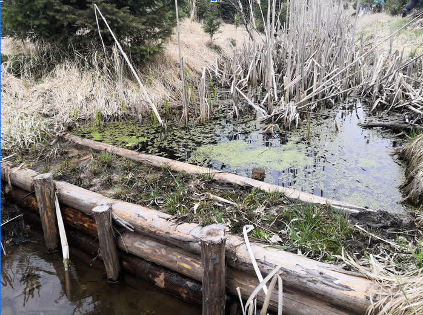

Vrstva
bod, linie

Charakteristika
Jedná se o přehrazení toku (především lesních bystřin) umělou hrázkou, nejčastěji dřevěnou, srubovou, ale také kamennou v síti (gabionovou) nebo kamennou betonovanou. 
Hlavní funkcí hrázky je retence vody a splaveného materiálu (spláví). 
Mohou být i hrázky polopropustné, které mají ve dně odtok o průměru odpovídajícího určitému průtoku. V případě srážek pak slouží k retenci vody.
Migrační prostupnost pro živočichy je velmi nízká (mimo polopropustné).

Dokumentace
Stav, usazení v toku, nátokovou stravu a stranu vývařiště a celkový pohled s charakterem okolní krajiny a vodního toku.
Parametry 
Výška, šířka v patě, šířka v koruně, materiál, zaplnění v %, materiál, stav, vodnatost
# Vodní pr. 
# V14. přehrážka v příkopu Vodní pr.
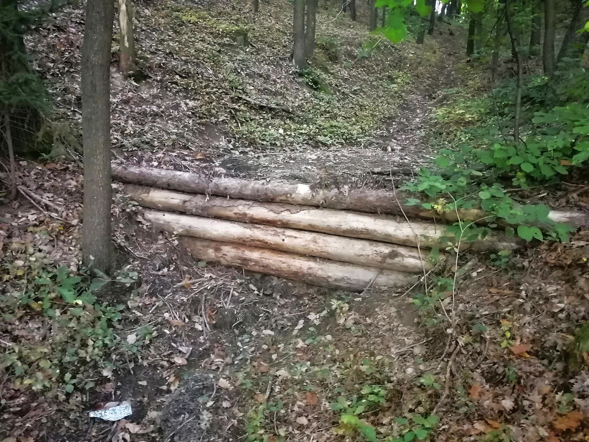

Vrstva
bod, linie

Charakteristika
Jedná se o přehrázku (viz. Přehrážka), ale pouze v suchém příkopu, který slouží např. jako odvodňovací kanál. 

Dokumentace
Stav, usazení v toku, nátokovou stravu a stranu vývařiště a celkový pohled s charakterem okolní krajiny a vodního toku.
Parametry 
Výška, šířka v patě, šířka v koruně, materiál, zaplnění v %, materiál, stav, vodnatost
